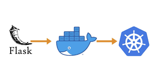
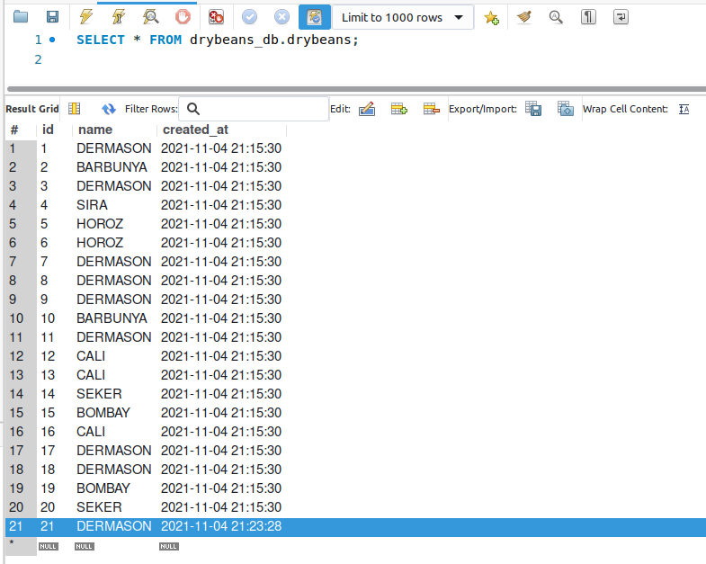

# Deploying a Machine Learning Model
### This is a step-by-step walkthrough of creating a simple classification model and deploying it via Google Kubernetes Engine (GKE) using Flask and Docker.



The example DryBeans classification app which will be discussed in this document has been deployed on GKE and can be accessed **here**.

The following sample request to the API would return a predicted class:

```
import json
import requests

url = 'http://34.118.33.84/predict'
payload = {'data': '[[33958.0, 677.1, 253.69, 171.05, 1.48, 0.74, 34241.0, \
                      207.93, 0.82, 0.99, 0.93, 0.82, 0.01, 0.0, 0.67, 1.0]]'}

response = requests.post(url, json=payload)
print(json.loads(response.content))
>> {'predictions': '["DERMASON"]'}
```

<br>

## Motivation

Machine Learning models need to be accessible in order to be useful. Therefore, Flask comes into play as it creates an API that can be easily accessed. Docker helps store all the dependencies of the model in an enclosed space (a container) so that the model could be easily shared and run autonomously on any system. Finally, Kubernetes is great at orchestrating large applications with multiple containers and is capable of scaling the computational resources as the demand grows.

Together, these tools make up a very powerful system capable of deploying complex applications.

<br>

## Contents

The project is split into two key parts - (1) local development which sets up the model and exposes an API on a local network and (2) deployment of the said model on GKE.

**The following will be covered in order of occurrence:**
- Creating a simple classification model with scikit-learn
- Creating a Flask app with the said model
- Connecting a MySQL database to store the results
- Packaging both the Flask app and the MySQL instance into Docker containers
- Combining both containers via Docker Compose
- Running these containers locally

At this stage, we have a working app. Next up is to host it somewhere so that it can be accessed from anywhere at all times. For such a simple app, Kubernetes is more than overkill, better alternatives exist. However, this walkthrough is not about being pragmatic, so it will continue by:

- Enabling GKE and Artifact Registry on Google Cloud Platform
- Uploading the app and its dependencies to the Artifact Registry
- Creating a GKE cluster
- Converting Docker Compose file to Kubernetes Resources
- Launching the app

<br>

## Local development
### 1. Creating a classification model

For the purposes of this walkthrough, a simple classification model will be built using the scikit-learn library. [The Dry Beans dataset](https://archive.ics.uci.edu/ml/datasets/Dry+Bean+Dataset) from the UCI repository will be used for training the model. The dataset consists of a single target feature (one of seven dry bean types) and 16 numerical feature variables defining bean characteristics such as size, shape and roundness. There are in total 13611 observations. A Support Vector Classifier will be used to classify these beans as it is quick to fit and often gives good results out of the box.

```
import pickle
import pandas as pd
import numpy as np
from sklearn.svm import SVC
from sklearn.model_selection import train_test_split

# Loading the data and separating target from the features
df = pd.read_csv('./data/Dry_Bean_Dataset.csv', encoding='unicode_escape')
y = df['Class']
X = df.drop('Class', axis=1)

# Splitting the data to training and test sets
X_train, X_test, y_train, y_test = train_test_split(X, y, test_size=0.3, random_state=17)

# Fitting a Support Vector Classifier with a linear kernel
svm = SVC(kernel='linear')
svm.fit(X_train, y_train)
preds = svm.predict(X_test)
accuracy = (preds==y_test).mean()

print(f'Prediction accuracy on test data: {"%.3f"%accuracy}')
>> Prediction accuracy on test data: 0.923
```

The fitted model provides a 92% accuracy on the test data. However, it is hard to say if this is a good result in absence of a baseline or without knowing more about the dataset. For our purposes though, this will do, therefore it is time to store the model in a file as such:

```
with open('./app/DryBeanSVM', 'wb') as file:
    pickle.dump(svm, file)
```

<br>

### 2. Creating a Flask app

The newly constructed model now needs to be wrapped within an app so that it could be simply used via an API call. Flask makes this straightforward. Below is an implementation for a DryBeans classification app.

```
import json
import pickle
import numpy as np
import sklearn
from flask import Flask, request, render_template

# Create a Flask app object
app = Flask(__name__)

@app.route('/')
def hello():
    """ Main page of the app. """
    return render_template('home.html')

@app.route('/predict', methods=['POST'])
def predict():
    """ Return JSON serializable output from the model """

    # Capture the payload
    payload = request.json
    X = np.array(json.loads(payload['data']))
    store_preds = True
    if 'store' in payload:
        store_preds = payload['store']

    # Load the classifier
    with open('DryBeanSVM', 'rb') as file:
        classifier = pickle.load(file)

    # Get the predictions
    predictions = classifier.predict(X)

    # Store them in the DB
    if store_preds:
        from mysql_con import push_to_sql
        push_to_sql(predictions)

    return {'predictions': json.dumps(predictions.tolist())}


if __name__ == '__main__':
    app.run(host='0.0.0.0', port=5000)
```

It has two access points. One is a root `'/'` access which leads to a home page that returns a static output defined by `/app/templates/home.html`. For the sake of simplicity, the `hello()` function could be changed to return any string and the functionality of the app would stay the same.

The second access point is the `'/predict'` route which leads to the model itself. It expects a JSON payload containing all 16 features of one or more beans. The payload is parsed and sent to the model which itself is loaded from a pickle file created earlier. Predictions are then returned as a JSON string as well as stored in a database by default (more on this in the next section).

At this point, the app can be launched with
```
python3 app.py
```
and accessed via `http://localhost:5000/`.

Predictions can also be made by sending a payload of features to the `/predict` route. Just make sure to include a `'store': False` flag. Otherwise, an error will be raised since no database exists as of yet.

```
import json
import requests

payload = {'data': '[[33958.0, 677.1, 253.69, 171.05, 1.48, 0.74, 34241.0, \
                      207.93, 0.82, 0.99, 0.93, 0.82, 0.01, 0.0, 0.67, 1.0]]',
           'store': False}

response = requests.post('http://localhost:5000/predict', json=payload)
print(json.loads(response.content))
>> {'predictions': '["DERMASON"]'}
```

<br>

### 3. Connecting to a database

The Flask app, defined earlier, called a `push_to_sql` function which was imported from a separate script. That script is defined below. Its purpose is to establish a connection with an existing instance of a MySQL database.

```
import os
from sqlalchemy import create_engine
from sqlalchemy import Column, String, Integer, Float, DateTime
from sqlalchemy.ext.declarative import declarative_base  
from sqlalchemy.orm import sessionmaker
from sqlalchemy.sql import func

# Create the MySQL connection string
# These environment variables will be passed to the system during container startup
db_string = f"mysql://\
{os.environ['MYSQL_USER']}:\
{os.environ['MYSQL_PASSWORD']}@\
{os.environ['MYSQL_HOST']}:3306/\
{os.environ['MYSQL_DB']}"

# Establish the connection
db = create_engine(db_string)
base = declarative_base()
session = sessionmaker(db)()

# Create a table for storing the predictions if it doesn't exist yet
db.execute('''
    CREATE TABLE IF NOT EXISTS drybeans (
	id INT AUTO_INCREMENT PRIMARY KEY,
    name VARCHAR(255) NOT NULL,
    created_at TIMESTAMP DEFAULT CURRENT_TIMESTAMP)
    ''')

class DryBeansSQL(base): 
    ''' Defining new entries '''
    __tablename__ = 'drybeans'
    id = Column(Integer, primary_key=True, autoincrement=True)
    created_at = Column(DateTime, default=func.now())
    name = Column(String)

def push_to_sql(array):
    '''  Pushing new data to storage '''
    for i in array:
        drybean = DryBeansSQL(name=i)
        session.add(drybean) 
        
    session.commit()
    print('Data upload complete!')
```

The script first establishes a connection to a MySQL database using environmental variables from the OS to form a connection string. Then it attempts to create an empty table to store prediction results. This table contains an `id`, `name` (the type) of the bean and a `created_at` timestamp.

Finally, it creates a `DryBeansSQL` object which defines the structure of new entries to the table and a `push_to_sql` function which sends these entries over to the database. With this, the database connection is ready. Now we just need to start one.

<br>

### 4. Creating Docker containers

The DryBeans app and the MySQL database now need to be containerised and launched together via Docker Compose. Luckily, there is no need to manually create a Docker image for MySQL instance as one already exists on Docker's repositories and can be pulled directly from there. For the DryBeans app, however, this has to be done manually.

First, we need to collect all the dependencies for the app. It can be easily done by running the following:

```
pipreqs .
```

This will create a `requirements.txt` file with a list of all imported libraries. It will later be used to install these libraries when creating a Docker image.

To create the said image, a `Dockerfile` needs to be set which will provide Docker with a list of instructions of what and how should be put together into an image. The following lists the instructions for the DryBeans image:

```
# syntax=docker/dockerfile:1

FROM python:3.8-slim-buster
WORKDIR /app
COPY requirements.txt .
RUN apt-get update
RUN apt-get install -y default-libmysqlclient-dev gcc
RUN pip3 install mysqlclient==2.0.3
RUN pip3 install -r requirements.txt
COPY . .
CMD [ "python3", "-m" , "flask", "run", "--host=0.0.0.0"]
```

This Dockerfile starts with a base python image from Docker repositories and builds upon it. It first creates a directory for the application and then copies over the `requirements.txt`. The subsequent four `RUN` commands install the requirements and several other dependencies for the MySQL Client. Finally, the remaining files are copied. The `CMD` command does not run during image creation, instead, it is used when launching the app.

With the Dockerfile ready, the image can finally be built using:

```
docker build -t <REPO_NAME>/drybeans-img .
```

Typing

```
docker images
```

should provide you with a list of currently available images among which you should find the new addition. Now that the image was built, it can be run with:

```
docker run -dp 5000:5000 <REPO_NAME>/drybeans-img
```

Just as before, though, include a `'store': False` in the payload when making predictions, else it will fail. This will be addressed in the next step.

<br>

### 5. Combining the DryBeans app and a MySQL database in a `docker-compose` file

The DryBeans app and the MySQL database can be launched separately. However, since they are both parts of essentially the same application it makes sense to launch them together via Docker Compose. This approach also ensures that both containers are on the same network and can talk to one another.

The `docker-compose` file below defines two services. The DryBeans app which uses the same image we just created and the MySQL database which is pulled directly from Docker repositories. Both of these services also have several environmental variables defined in order to establish the database connection.

```
version: '3.7'

services:
  app:
    image: USERNAME/drybeans-img
    ports:
    - 5000:5000
    working_dir: /app
    environment:
      MYSQL_HOST: mysql
      MYSQL_USER: root
      MYSQL_PASSWORD: secret
      MYSQL_DB: drybeans_db

  mysql:
    image: mysql:5.7
    ports:
    - 3306:3306
    volumes:
    - drybeans-vol:/var/lib/sql
    environment:
      MYSQL_ROOT_PASSWORD: secret
      MYSQL_DATABASE: drybeans_db

volumes:
  drybeans-vol:
```


<br>

### 6. Launching the app

Finally, with everything ready, the DryBeans classification app together with a MySQL database which stores the predictions can be launched with a single command:

```
docker-compose up
```

Both running containers should appear under:

```
docker ps
```

Payloads can now be sent to the API and results will be stored in the database:

```
import json
import requests

payload = {'data': '[[33958.0, 677.1, 253.69, 171.05, 1.48, 0.74, 34241.0, \
                      207.93, 0.82, 0.99, 0.93, 0.82, 0.01, 0.0, 0.67, 1.0]]'}

response = requests.post('http://localhost:5000/predict', json=payload)
print(json.loads(response.content))
>> {'predictions': '["DERMASON"]'}
```



The contents of the database will persist even if it is shut down. This is taken care of by assigning volume space in the `docker-compose` file.


## Deploying on Kubernetes

The official [GKE tutorial](https://cloud.google.com/kubernetes-engine/docs/tutorials/hello-app) for launching dockerised applications covers the process in great detail. Here I will summarise the key steps and focus mostly on part of the process where it is different - namely using a `docker-compose` file with two services instead of simply launching a single image as is in the tutorial.

### 7. Enabling GKE and Artifact Registry on Google Cloud Platform

The first few steps are exactly the same. Make sure you have created a Google Cloud project and have Artifact Registry and Google Kubernetes Engine APIs enabled.

With that covered, a project needs to be set up and an Artifacts repository allocated to it:

```
export PROJECT_ID=drybeans

gcloud config set project $PROJECT_ID

gcloud artifacts repositories create drybeans-repo \
   --repository-format=docker \
   --location=europe \
   --description="Docker repository"
```

### 8. Uploading the app and its dependencies to the Artifact Registry

Once the artifact repository is created it can be populated with the docker image of the DryBeans app. To do so, let's first clone the git repository and build the image:

```
git clone https://github.com/vinas94/ModelDeployment.git

cd ModelDeployment/app/

docker build -t europe-docker.pkg.dev/${PROJECT_ID}/drybeans-repo/drybeans-app:v1 .
```

With the image created it can be pushed to the Artifact Registry as so:

```
gcloud auth configure-docker europe-docker.pkg.dev

docker push europe-docker.pkg.dev/drybeans/drybeans-repo/drybeans-app:v1
```

### 9. Creating a GKE cluster

Next on the list is to create a GKE cluster where the images will run:

```
gcloud config set compute/region europe-central2

gcloud container clusters create-auto drybeans-cluster
```


### 10. Converting Docker Compose file to Kubernetes Resources

This is where we deviate significantly from the official tutorial from GCP. There a single image is launched directly. However, we want to use a `docker-compose` file to launch several connected services at once. To do so, the `docker-compose` file needs to be converted to a format that can be read by `kubectl`.

Before we begin with the conversion it is important to modify the `docker-compose` file and update the path to the DryBean app image.

```
nano docker-compose.yml
```

Update the drybeans image path to `europe-docker.pkg.dev/drybeans/drybeans-repo/drybeans-app:v1`


```
curl -L https://github.com/kubernetes/kompose/releases/download/v1.24.0/kompose-linux-amd64 -o kompose
chmod +x kompose
sudo mv ./kompose /usr/local/bin/kompose
```


gcloud container clusters get-credentials drybeans-cluster --region europe-central2


kompose convert


### 11. Launching the app

kubectl apply -f app-service.yaml,mysql-service.yaml,app-deployment.yaml,mysql-deployment.yaml,drybeans-vol-persistentvolumeclaim.yaml

kubectl expose deployment app --name=drybeans-service --type=LoadBalancer --port 80 --target-port 5000

kubectl get service


